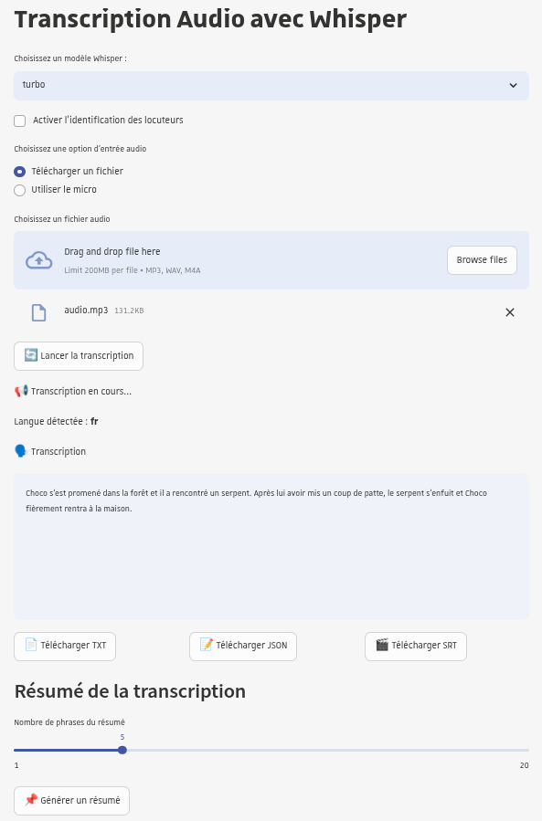

# IAAT Whisper


Ce projet est une application web casifiée basée sur Streamlit et Whisper qui permet d'uploader un fichier audio ou d'utiliser son
micro pour transcrire le texte de l'audio, détecter les différents locuteurs et générer un résumé.
Il permet également de générer des sous-titres de vidéos et de
les traduire en plusieurs langues.

## Prérequis

- **Python 3.11+**
- **ffmpeg** (pour le traitement des fichiers audio)
- **libportaudio2** (pour la prise en charge du micro dans l'application Streamlit)
- **Rust** (nécessaire si aucune wheel précompilée n'est disponible pour votre plateforme)
- **LLM compatible OpenAPI** (pour la génération de synthèse, testé avec daredevil-8b)

## Installation pour le développement

- Créer un environnement virtuel :
  ```bash
  python3.11 -m venv .env
  ```
- Activer l'environnement virtuel :
  ```bash
  source .env/bin/activate
  ```
- Installer les dépendances :
  ```bash
  pip install -r requirements-dev.txt
  ```
- Créer le fichier de configuration des secrets :
  ```bash
  touch .streamlit/secrets.toml
  ```
- Configurer les paramètres dans **.streamlit/secrets.toml** :
  ```toml
  [auth]
  redirect_uri = "http://localhost:8501/oauth2callback"
  cookie_secret = "cookiesecret"
  client_id = "whisperid"
  client_secret = "whispersecret"
  server_metadata_url = "https://mycasurl/cas/oidc/.well-known/openid-configuration"
  client_kwargs = { "prompt" = "login" }

  [huggingface]
  token = "hf_secret"

  [llm]
  url="http://my-vllm:8000/v1"
  token="s3cre3t"
  model="mistralai/Mistral-7B-Instruct-v0.3"
  max_tokens=32768
  temperature=0.4

  [app]
  use_custom_style = false
  sumy_length_default = 80
  whisper_model = "turbo"
  transcription_mode = "local" # ou "api"
  ```
- Si vous souhaitez utiliser la police UnistraA (`use_custom_style = true`), vous devez télécharger les fichiers de police UnistraA (`UnistraA-Regular.ttf`, `UnistraA-Bold.ttf`, etc.) et les placer dans le dossier `app/static/fonts` du projet (ex: `app/static/fonts/UnistraA-Regular.ttf`).
- Lancer les tests unitaires via:
  ```
  coverage run -m pytest && coverage report
  ```
- Démarrer l'application Streamlit :
  ```bash
  streamlit run app/Accueil.py
  ```

## Lancer un container Docker

- Builder l'image et démarrer l'application via Docker :
  ```bash
  docker build -t whisper-app .
  docker run --gpus all -d -p 8501:8501 --name whisper-container \
    -e REDIRECT_URI="http://localhost:8501/oauth2callback" \
    -e COOKIE_SECRET="S3CR3T" \
    -e CLIENT_ID="whisperid" \
    -e CLIENT_SECRET="whispersecret" \
    -e CLIENT_PROMPT="login" \
    -e SERVER_METADATA_URL="https://yourcasurl/cas/oidc/.well-known/openid-configuration" \
    -e HUGGINGFACE_ACCESS_TOKEN="hf_secret" \
    -e LLM_URL="your-llm-url" \
    -e LLM_TOKEN="your-llm-token" \
    -e LLM_MODEL="your-llm-model" \
    -e LLM_MAX_TOKENS="32768" \
    -e LLM_TEMPERATURE="0.4" \
    -e USE_CUSTOM_STYLE="false" \
    -e SUMY_LENGTH_DEFAULT="80" \
    -e WHISPER_MODEL="turbo"\
    -e TRANSCRIPTION_MODE="local" \
    whisper-app
  ```

## Aperçu



## Fonctionnalités

### Compte-rendu de Réunion
- Enregistrement direct via microphone
- Support des fichiers audio (mp3, wav, m4a)
- Identification des intervenants (diarisation)
- Génération de synthèse automatique
- Choix du type de synthèse (compte-rendu de réunion, résumé de présentation, etc.)
- Téléchargement de la transcription et de la synthèse

### Sous-titrage de Vidéos
- Support des fichiers vidéo
- Synchronisation des sous-titres
- Traduction automatique des sous-titres
- Export en format SRT/VTT

### Interface Utilisateur
- Authentification CAS
- Interface responsive (mobile et desktop)
- Design moderne et intuitif

### Limitations Actuelles
- Temps de traitement variable selon la taille du fichier
- Précision variable selon la qualité audio
- Taille maximale de fichier : 10 Go
- Nécessite une connexion internet stable
- Qualité variable selon le microphone utilisé
